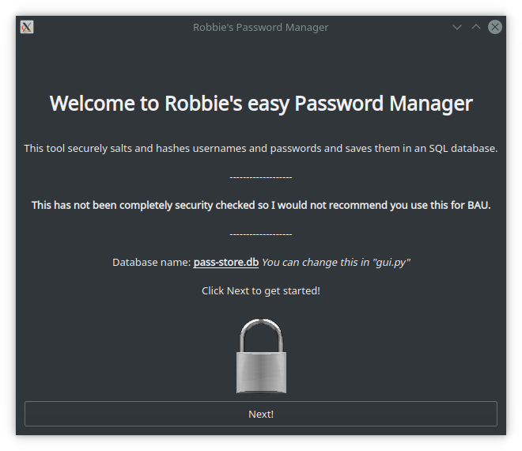
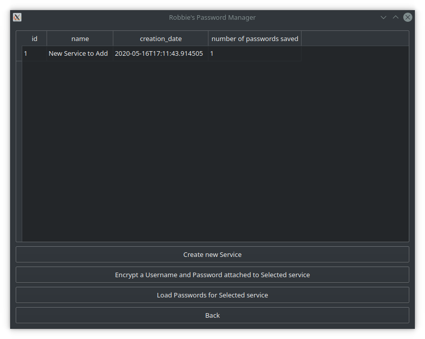
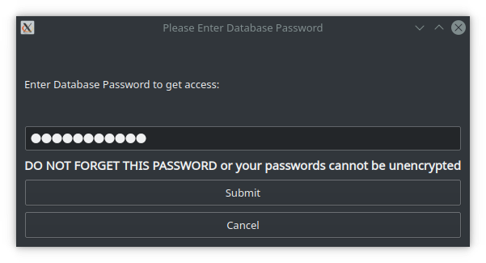
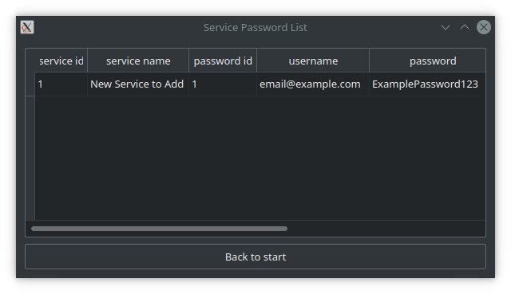

# Robbie's Simple Password Manager

Simple tool which stores salted and hashed passwords in a database
with a seperate name lookup database.

Not intended for actual use, just a proof of concept to exhibit the
different tools working together.

Solo development to advance my python skills and knowledge.

#### Technologies used

[Cryptography](https://pypi.org/project/cryptography/) <br>
[PyQt5](https://pypi.org/project/PyQt5/) <br>
[PySQLite](https://pypi.org/project/pysqlite/)

## Usage:
Clone the git repo and enter the directory
```
git clone https://github.com/wattsra/passstore.git
cd passstore
```
###Install requirements
Use pip method
```
python3 -m pip install -r requirements.txt
```
For Ubuntu/debian you may need to install pyqt5 from your package manager like below.
```
sudo apt install python3-pyqt5 
```
Run the app
```
python3 gui.py
```
For older 

##Screenshots



Multiple services (gmail, skype, eBay, etc.) can be stored each with multiple passwords and usernames <br>


Data is salted and hashed using a password. This cannot be recovered


Database holds data after it has been salted and hashed <br> 


Usernames and passwords are not readable in plain text. Salt is saved as a bytes object.


